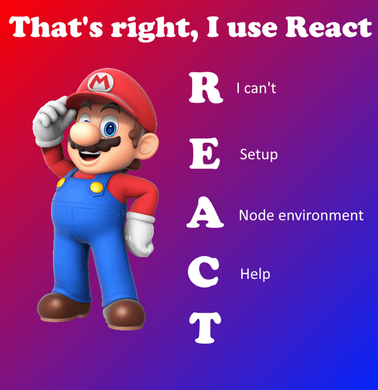

# 👏 React Code Review 

# Чеклист ревьюера

## Можно ли упростить инфраструктуру проекта? Как бы вы посоветовали ее реорганизовать?

### 📁 package.json

Let's take a look to your `package.json`:
```
{
    "name": "react-router", 
    "version": "1.0.0",
    "private": true,
    ...
}
```
- [ ]  name and version attribute [is optional](https://github.com/npm/npm/issues/18781) for private packages.
```
    "react": "^16.2.0",
    "react-dom": "^16.2.0",
    "react-redux": "^5.0.7",
    "react-router": "^4.2.0",
    "react-router-dom": "^4.2.2",   
    "redux": "^4.0.0",
    "redux-thunk": "^2.2.0",
```

These packages should be preset in dependencies - you will use it in your app.

```
    "@babel/core": "7.8.7",
    "@babel/preset-env": "7.8.7",
    "@babel/preset-react": "7.8.3",
    "babel-loader": "8.0.6",
    "babel-jest": "25.1.0",
    "webpack": "4.42.0",
    "webpack-cli": "3.3.11",
    "enzyme": "3.11.0",
    "enzyme-adapter-react-16": "1.15.2",
    "eslint": "6.8.0",
    "eslint-plugin-react": "^7.19.0",
    "jest": "25.1.0",
    "react-scripts": "1.1.1",
    "react-test-renderer": "16.13.0",
    "webpack-dev-server": "3.10.3"
```


- [ ]  These packages used for development purpose: build, transpose, test, etc. Your app will run without that packages. Better to move it to `devDependencies`.
(_only to show my skills, I will never give full solution to a student_)

```
"scripts": { 
    "build": "webpack --mode production",
}
```
- [ ]  Better to remove the build target directory before each build. Please note that `rm -rf` will work only in systems that have [rm](https://en.wikipedia.org/wiki/Rm_\(Unix\)) command in [CLI](https://en.wikipedia.org/wiki/Command-line_interface). For example in my own system, windows 10, I have [del](https://docs.microsoft.com/en-us/windows-server/administration/windows-commands/del) instead of rm. To unify this process please use [rimraf](https://www.npmjs.com/package/rimraf) package instead of rm command.

- [ ]  You can increase readability of `eslint --ext .jsx --ext .js src/` by replacing it with `eslint --ext .jsx,.js src/`. [Learn more about ESLint CLI](https://eslint.org/docs/user-guide/command-line-interface)

```
"devDependencies": {
    "husky": "^0.14.3",
  }
```

- [ ]  Husky package doesn't have correct config for your project. Please read [Husky reference](https://www.npmjs.com/package/husky) to learn more about husky.

### 📁 .gitignore

- [ ]  better to add build target directory to ignore because it's generated code and not supposed to be a part of code base.

### 📁 webpack.config.js

```
 devtool: `source-map`,
```

- [ ]  Better to avoid using backtick for not string template purposes. Make this code consistent with other - use regular single quote.

- [ ]  better to add build target directory to ignore because it's generated code and not supposed to be a part of code base.
### Overall 

- [ ]  it would be great if you add [Editor config](https://editorconfig.org/) to unify IDE config.
- [ ]  Only for my opinion, it's would be handful to group all store entities (like actions and reducers) under parent directory. It will increase code readability because, as I can see, it's a good practice for most of the developers in industry.
- [ ]  You can use `overlay` [key](https://webpack.js.org/configuration/dev-server/#devserveroverlay) in webpack dev server to show compile errors on page if it preset.

- [ ]  Better to output build result to not `public` directory to easily remove it before next build.

- [ ]  It is possible to simplify the project infrastructure, but this will harm code readability, so I suggest following my recommendations instead of simplify infrastructure. 

- [ ]  Styles should be minified and bundled.

## Корректно ли написаны тесты для компонент? Корректно ли валидируются пропсы?

- [ ]  There are only for `app.jsx`. Better to cover all project with tests.
- [ ]  ESLint tests fails
- [ ]  Only snapshots test added. Better to add another handful type of tests - snapshot will fail if whole App markup is not the same as saved in a snapshot. Learn more about other types of tests [here](https://frontendmasters.com/courses/testing-react/).
- [ ]  It's valuable to avoid testing whole `<App>` tree. Write independent tests for each `<App>` component and test it in parallel - when one of components will fail, whole page not be fall. (_idk what supposed to be tested, if whole page layout - it's ok_)
- [ ]  App works with API, so it would be great to add not only visual tests - cover logic and network with tests too.
- [ ]   Module [prop-types](https://www.npmjs.com/package/prop-types) is not listed in package.json dependencies. 
- [ ]  `data` props is defined in `MotFound`, but never used.
- [ ]  `Profile` trying to validate using `proptypes`, but expected to use `PropTypes`, possible a typo.
- [ ]  `ProfileContainer` and `PrivateRoute` props is not validated.


##  Корректно ли выполняется рендер компонент?

- [ ]  Fonts linked from external resource is forbidden in all projects and generally a bad practice. 
- [ ]  `lang` attribute set to `en`, but content is not in english language.
- [ ]  `<noscript>` content is on english language, but other app is on Russian language.
- [ ]  Heading level 1 is missing on the main page. [Learn more about heading order importance](https://web.dev/heading-order/).
- [ ]  As a render result you have `<button>` nested inside `<a>`, this is interactive element inside interactive element. It's invalid markup and logic - browser can't predict which interact should be executed.
- [ ]  Better to make `ul` of `<a>` instead of *group* it with `<div>`. The `<div>` element here is not the best practice.
`<div>` is usually technical container in which we place the markup. It may contain other block elements, we mainly use such a container for subsequent styling of the content, as `<div>` itself does not make any sense, but is an ordinary block element (according to the old content model) or flow-content (according to the HTML5 content model).
More information about HTML5 content models can be found [here](https://www.w3.org/TR/2011/WD-html5-20110525/content-models.html).
- [ ]  `<main>` tag and `<section>` tag is missing/replaced with `<div>`. As mentioned before, it's a bad practice to spread `<div>` cancer.
- [ ]  Better to give meaningful title for your document. Please note that your app have different pages with different purposes, so `title` should be updated respectively.
- [ ]  Buttons do not have an accessible name. When a button doesn't have an accessible name, screen readers and other assistive technologies announce it as button, which provides no information to users about what the button does. [Learn more](https://web.dev/button-name/)
- [ ]  It's good you added `theme-color` meta (but black for a white page - possible bug), but also will be great if you add `description` meta tag to your app. Please note that your app have different pages with different purposes, so description should be updated respectively. 
- [ ]  Input fields do not have accessible names. [Learn more](https://web.dev/aria-input-field-name/)


## Правильно ли настроены все роуты, в том числе и защищенные?
 - [X]  This part LGTM.
 - [ ]  Better to hide `login` link to authorized users. 
 - [ ]  Better to correctly setup dev server and backend server to handle 404 pages on a non index URLs. (_I didn't get from project description, is it supposed to redirect not found links to `/kvazavr` or it's just example of not existent link? Redirect not works - may be an issue_)
## Оптимально ли написаны компоненты? Правильно ли выделены функциональные компоненты?

- [ ]  There is no reason to introduce new component for LoginContainer.
- [ ]  Better to transform `Login` to function component. [HOC](https://reactjs.org/docs/higher-order-components.html) and [hooks](https://reactjs.org/docs/hooks-state.html#hooks-and-function-components) can be helpful for this job.

## Корректно ли описаны `Actions`, `Reducers`?

- [ ]  `error:true` in login failure is unused. 
- [ ]  Logout action is not implemented, but reducer ready for it. Also `initialState` can be returned from this case in a reducer, this will minimize typo/type errors in future development. 

## Miscellaneous 

- [ ]  `network:7` ` Promise.reject` supposed to be returned, but ignored.
- [ ]  `network:11` `err` is defined but never used. Also `alert` used - this is a very bad practice even for debug. Better to use `console.error` and send `err` to it. Remember to remove all console calls before submitting work.
- [ ]  `network:10` redundant code.
- [ ]  `network.js` remove unused code - you can always get it from git history.
- [ ] `checkCredentials` have redundant `if` inside it. This is control flow issue, entire function can be simplified to this: 
```
return !(params.userName.toLowerCase() !== 'student' ||  params.password !== 'student');
```
